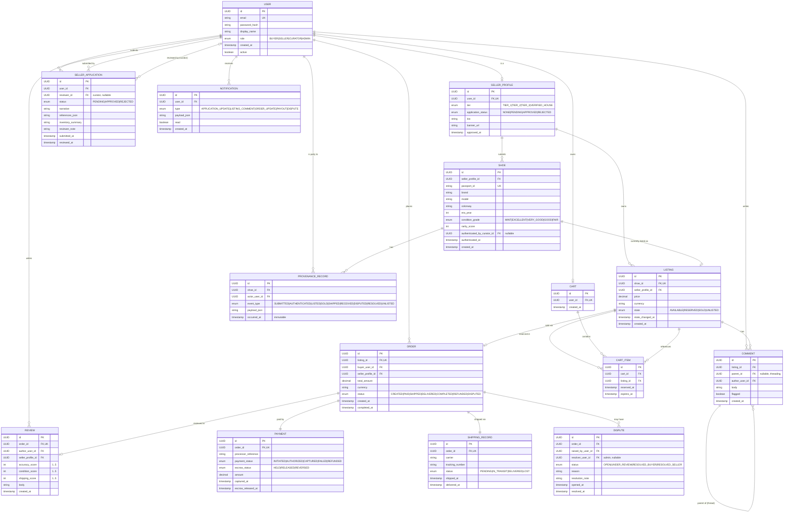

# 1.1 — Entity Relationship Diagram

> **Marker legend.** `PK` = primary key, `FK` = foreign key, `UK` = unique constraint. Cardinality uses crow's-foot notation: `||--o{` is one-to-many, `||--||` one-to-one, `||--o|` one-to-zero-or-one.

## Notes

- **`ProvenanceRecord`** has no `updated_at`; entries are immutable once written.
- **`Shoe` ↔ `Listing`** is 1-to-0/1 — a shoe can exist without an active listing (e.g. after sale, between listings).
- **`Order` ↔ `Listing`** is 1-to-1; a listing can be sold at most once in its lifetime.
- **`Payment.escrow_status`** is tracked independently of `payment_status` because captured funds may still be held.
- **`SellerProfile.application_status`** is a denormalized cache of the latest `SellerApplication.status` for fast gating of seller-only actions.
