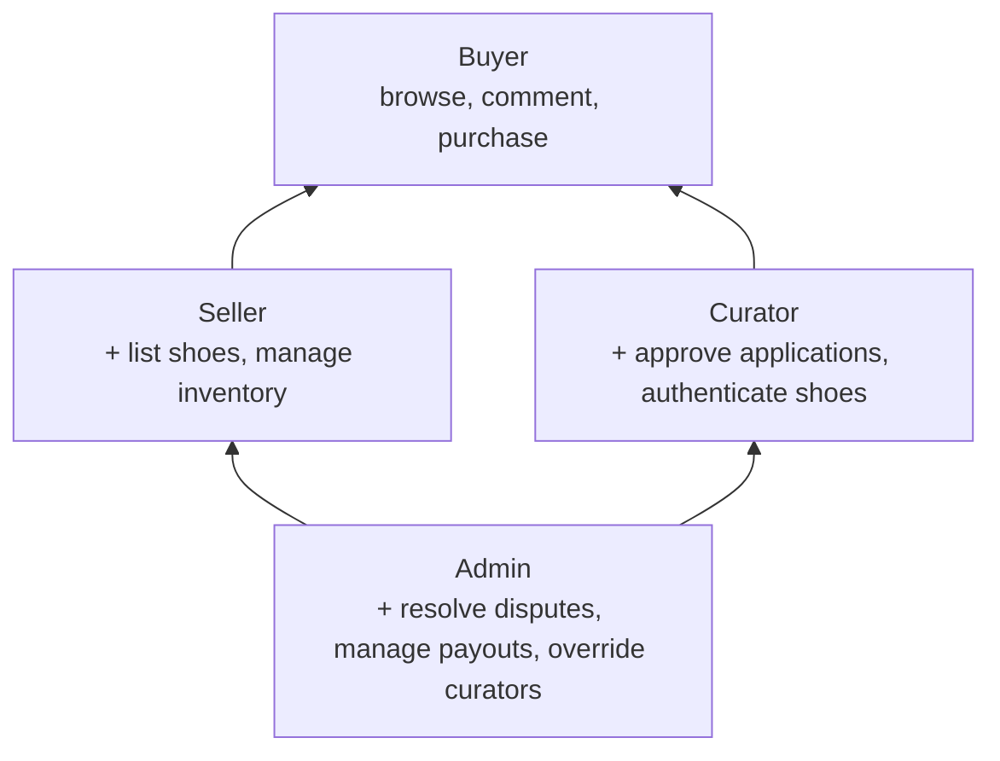

# 1.2 — Use Case Diagram

```mermaid
flowchart LR
    Buyer([Buyer])
    Seller([Seller])
    Curator([Curator])
    Admin([Admin])

    subgraph Catalog [Catalog & Discovery]
        UC1[Browse & search listings]
        UC2[View shoe passport]
        UC3[Save to wishlist]
    end

    subgraph Account [Account]
        UC4[Register / login]
        UC5[Manage profile]
    end

    subgraph Buying [Buying]
        UC6[Add to cart]
        UC7[Checkout & pay]
        UC8[Track order]
        UC9[Confirm receipt]
        UC10[Leave review]
        UC11[Raise dispute]
    end

    subgraph Selling [Selling]
        UC12[Submit seller application]
        UC13[Submit shoe for auth]
        UC14[Create listing]
        UC15[Edit / unlist listing]
        UC16[Respond to comments]
        UC17[View seller dashboard]
    end

    subgraph Curation [Curation]
        UC18[Review seller applications]
        UC19[Authenticate shoe]
        UC20[Grade & score listing]
        UC21[Assign seller tier]
        UC22[Flag / remove listing]
    end

    subgraph Community [Community]
        UC23[Post comment]
        UC24[Reply to comment]
    end

    subgraph Administration [Administration]
        UC25[Resolve dispute]
        UC26[Manage payouts]
        UC27[View analytics]
        UC28[Manage users & roles]
        UC29[Override curator decision]
    end

    Buyer --> UC1
    Buyer --> UC2
    Buyer --> UC3
    Buyer --> UC4
    Buyer --> UC5
    Buyer --> UC6
    Buyer --> UC7
    Buyer --> UC8
    Buyer --> UC9
    Buyer --> UC10
    Buyer --> UC11
    Buyer --> UC23
    Buyer --> UC24

    Seller --> UC4
    Seller --> UC5
    Seller --> UC12
    Seller --> UC13
    Seller --> UC14
    Seller --> UC15
    Seller --> UC16
    Seller --> UC17
    Seller --> UC23
    Seller --> UC24

    Curator --> UC4
    Curator --> UC18
    Curator --> UC19
    Curator --> UC20
    Curator --> UC21
    Curator --> UC22

    Admin --> UC4
    Admin --> UC25
    Admin --> UC26
    Admin --> UC27
    Admin --> UC28
    Admin --> UC29
    Admin --> UC22
    Admin --> UC21
```

## Role inheritance

Every role *includes* the capabilities of the roles below it. A seller can still buy; an admin can do everything a curator can.

> Inheritance is **capability-only**, not literal Java inheritance. In the data model every account has exactly one `UserRole`; the security layer simply allows higher-privileged roles to pass checks for lower ones (see `SecurityConfig`).

## Notes

- **Public unauthenticated** use cases: `Browse & search`, `View shoe passport`. Everything else requires an account.
- **Privilege escalation:** admins can perform all curator actions (`UC22`, `UC21`) and override curator decisions (`UC29`).
