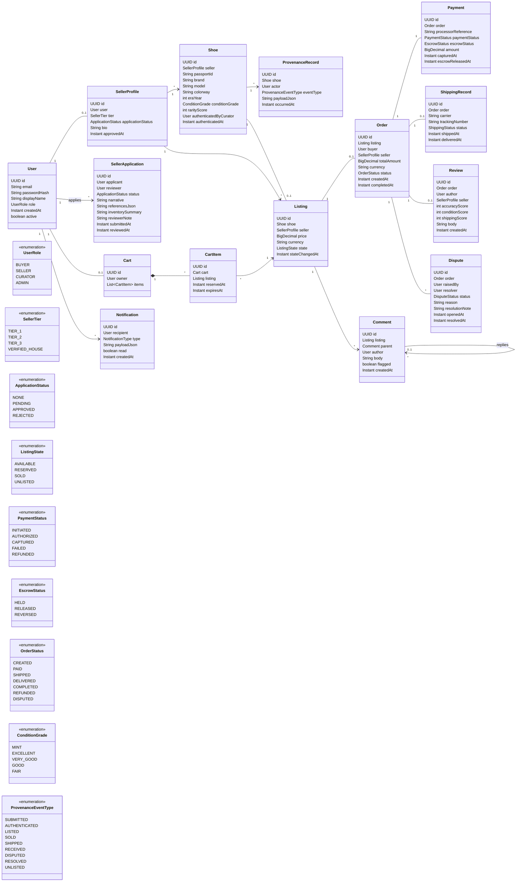

# 1.3 — Class Diagram

This file has two complementary views of the same code. **3.1** is the domain (entities + enums + relationships). **3.2** is the service layer (interfaces + key constraints). They render as separate Mermaid blocks because Mermaid handles each better in isolation.

## 3.1 — Domain model

---

## 3.2 — Service interfaces

```mermaid
classDiagram
    direction TB

    class UserService {
        <<interface>>
        +register(RegisterRequest) User
        +login(LoginRequest) TokenPair
        +getProfile(UUID) User
        +updateRole(UUID, UserRole) User
    }

    class SellerApplicationService {
        <<interface>>
        +submit(UUID applicantId, ApplicationData) SellerApplication
        +approve(UUID appId, UUID curatorId, SellerTier, String note) SellerApplication
        +reject(UUID appId, UUID curatorId, String note) SellerApplication
        +listPending() List~SellerApplication~
    }

    class ListingService {
        <<interface>>
        +create(UUID sellerId, CreateListingRequest) Listing
        +reserve(UUID listingId) Listing
        +markSold(UUID listingId) Listing
        +unlist(UUID listingId, UUID sellerId) Listing
        +findById(UUID) Listing
        +search(ListingFilter) Page~Listing~
    }

    class ProvenanceService {
        <<interface>>
        +append(UUID shoeId, UUID actorId, ProvenanceEventType, String payload) ProvenanceRecord
        +chainFor(UUID shoeId) List~ProvenanceRecord~
    }

    class CartService {
        <<interface>>
        +addItem(UUID userId, UUID listingId) CartItem
        +removeItem(UUID userId, UUID cartItemId) void
        +reserveListing(UUID userId, UUID listingId) CartItem
        +releaseExpired() int
    }

    class OrderService {
        <<interface>>
        +createFromCart(UUID userId) Order
        +findById(UUID) Order
        +findByBuyer(UUID buyerId) List~Order~
        +markShipped(UUID orderId) Order
        +markDelivered(UUID orderId) Order
        +complete(UUID orderId) Order
    }

    class PaymentService {
        <<interface>>
        +initiate(UUID orderId) Payment
        +confirm(UUID paymentId, String processorRef) Payment
        +releaseEscrow(UUID paymentId) Payment
        +refund(UUID paymentId, String reason) Payment
    }

    class CommentService {
        <<interface>>
        +post(UUID listingId, UUID authorId, String body) Comment
        +reply(UUID parentId, UUID authorId, String body) Comment
        +threadFor(UUID listingId) List~Comment~
        +flag(UUID commentId, UUID byUserId) Comment
    }

    class ReviewService {
        <<interface>>
        +submit(UUID orderId, UUID authorId, ReviewScores, String body) Review
        +findByListing(UUID listingId) List~Review~
        +findBySeller(UUID sellerId) List~Review~
    }

    class DisputeService {
        <<interface>>
        +open(UUID orderId, UUID byUserId, String reason) Dispute
        +resolve(UUID disputeId, UUID adminId, DisputeStatus outcome, String note) Dispute
        +findByOrder(UUID orderId) List~Dispute~
    }

    note for ProvenanceService "APPEND-ONLY.\nNo update(), no delete()."
    note for ListingService "State transitions are\nexplicit methods — not\narbitrary state setters."
    note for PaymentService "releaseEscrow() is distinct\nfrom confirm(): capture does\nnot auto-release funds."
```

