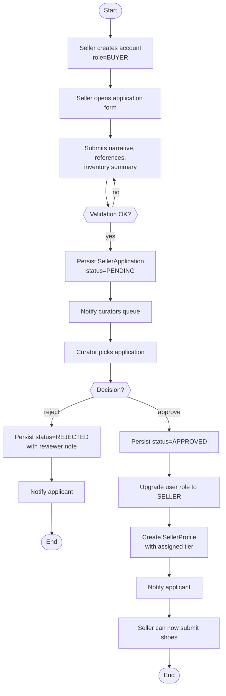
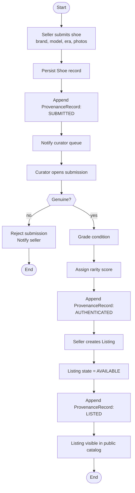
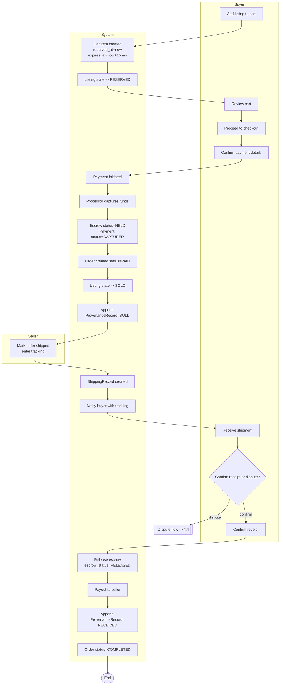
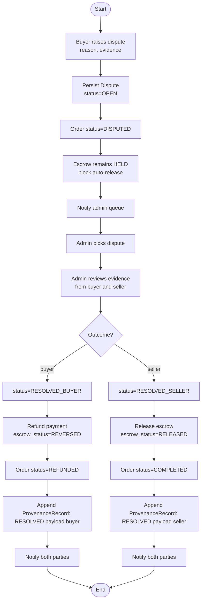

# 1.4 — Activity Diagrams

## 4.1 — Seller Onboarding

```mermaid
flowchart TD
    Start([Start]) --> A1["Seller creates account<br/>role=BUYER"]
    A1 --> A2[Seller opens application form]
    A2 --> A3[Submits narrative, references,<br/>inventory summary]
    A3 --> A4{{Validation OK?}}
    A4 -- no --> A3
    A4 -- yes --> A5[Persist SellerApplication<br/>status=PENDING]
    A5 --> A6[Notify curators queue]
    A6 --> A7[Curator picks application]
    A7 --> A8{{Decision?}}
    A8 -- reject --> A9[Persist status=REJECTED<br/>with reviewer note]
    A9 --> A10[Notify applicant]
    A10 --> EndR([End])
    A8 -- approve --> A11[Persist status=APPROVED]
    A11 --> A12[Upgrade user role to SELLER]
    A12 --> A13[Create SellerProfile<br/>with assigned tier]
    A13 --> A14[Notify applicant]
    A14 --> A15[Seller can now submit shoes]
    A15 --> End([End])
```

---

## 4.2 — Shoe Authentication

```mermaid
flowchart TD
    Start([Start]) --> B1[Seller submits shoe<br/>brand, model, era, photos]
    B1 --> B2[Persist Shoe record]
    B2 --> B3["Append ProvenanceRecord:<br/>SUBMITTED"]
    B3 --> B4[Notify curator queue]
    B4 --> B5[Curator opens submission]
    B5 --> B6{{Genuine?}}
    B6 -- no --> B7[Reject submission<br/>Notify seller]
    B7 --> EndR([End])
    B6 -- yes --> B8[Grade condition]
    B8 --> B9[Assign rarity score]
    B9 --> B10["Append ProvenanceRecord:<br/>AUTHENTICATED"]
    B10 --> B11[Seller creates Listing]
    B11 --> B12[Listing state = AVAILABLE]
    B12 --> B13["Append ProvenanceRecord:<br/>LISTED"]
    B13 --> B14[Listing visible in public catalog]
    B14 --> End([End])
```

---

## 4.3 — Purchase & Escrow

```mermaid
flowchart TD
    subgraph Buyer_Lane [Buyer]
        C1[Add listing to cart]
        C2[Review cart]
        C3[Proceed to checkout]
        C4[Confirm payment details]
        C7[Receive shipment]
        C8{Confirm receipt or dispute?}
        C9[Confirm receipt]
    end

    subgraph System_Lane [System]
        C1a[CartItem created<br/>reserved_at=now<br/>expires_at=now+15min]
        C1b[Listing state -> RESERVED]
        C4a[Payment initiated]
        C4b[Processor captures funds]
        C4c[Escrow status=HELD<br/>Payment status=CAPTURED]
        C4d[Order created status=PAID]
        C4e[Listing state -> SOLD]
        C4f["Append ProvenanceRecord: SOLD"]
        C6a[ShippingRecord created]
        C6b[Notify buyer with tracking]
        C10[Release escrow<br/>escrow_status=RELEASED]
        C11[Payout to seller]
        C12["Append ProvenanceRecord: RECEIVED"]
        C13[Order status=COMPLETED]
    end

    subgraph Seller_Lane [Seller]
        C5[Mark order shipped<br/>enter tracking]
    end

    C1 --> C1a --> C1b --> C2 --> C3 --> C4 --> C4a --> C4b --> C4c --> C4d --> C4e --> C4f
    C4f --> C5 --> C6a --> C6b --> C7 --> C8
    C8 -- confirm --> C9 --> C10 --> C11 --> C12 --> C13 --> End([End])
    C8 -- dispute --> Disp[[Dispute flow -> 4.4]]
```

---

## 4.4 — Dispute Resolution

```mermaid
flowchart TD
    Start([Start]) --> D1["Buyer raises dispute<br/>reason, evidence"]
    D1 --> D2[Persist Dispute<br/>status=OPEN]
    D2 --> D3[Order status=DISPUTED]
    D3 --> D4[Escrow remains HELD<br/>block auto-release]
    D4 --> D5[Notify admin queue]
    D5 --> D6[Admin picks dispute]
    D6 --> D7[Admin reviews evidence<br/>from buyer and seller]
    D7 --> D8{Outcome?}
    D8 -- buyer --> D9[status=RESOLVED_BUYER]
    D9 --> D10["Refund payment<br/>escrow_status=REVERSED"]
    D10 --> D11[Order status=REFUNDED]
    D11 --> D12["Append ProvenanceRecord: RESOLVED payload buyer"]
    D12 --> D13[Notify both parties]
    D13 --> End([End])
    D8 -- seller --> D14[status=RESOLVED_SELLER]
    D14 --> D15["Release escrow<br/>escrow_status=RELEASED"]
    D15 --> D16[Order status=COMPLETED]
    D16 --> D17["Append ProvenanceRecord: RESOLVED payload seller"]
    D17 --> D18[Notify both parties]
    D18 --> End
```
