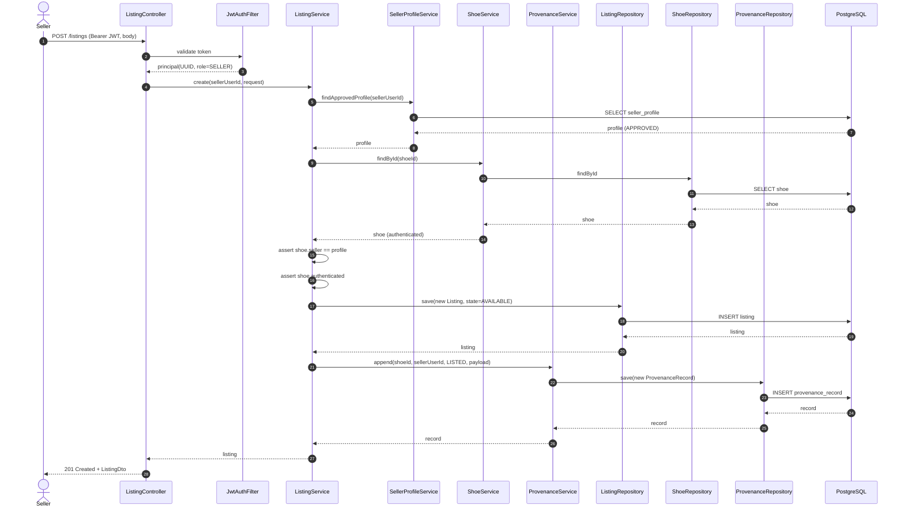
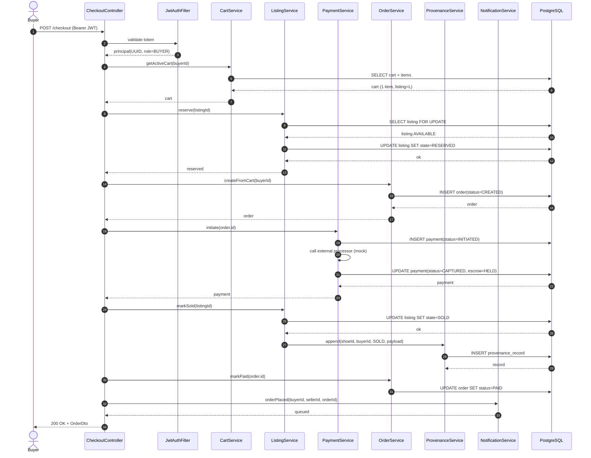
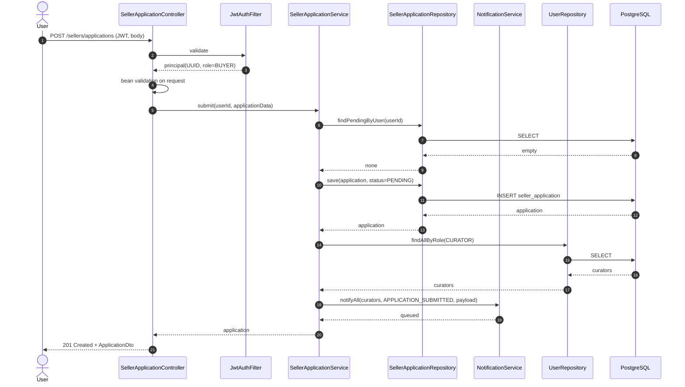
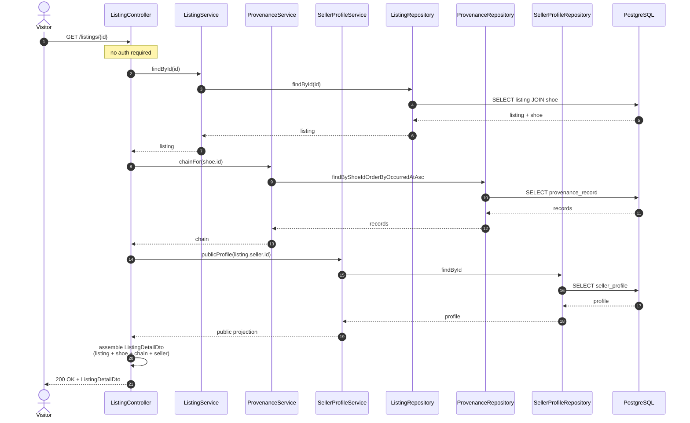

# 1.5 — Sequence Diagrams

## 5.1 — POST /listings (Seller creates a listing)

---

## 5.2 — POST /checkout (Buyer completes purchase)

---

## 5.3 — POST /sellers/applications

---

## 5.4 — GET /listings/{id} (Public)

