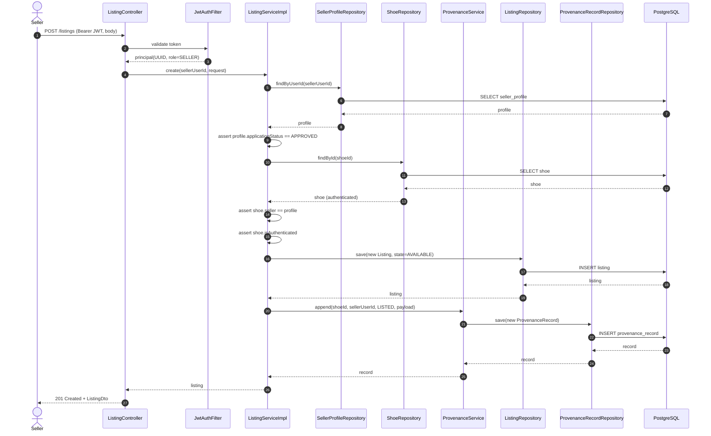
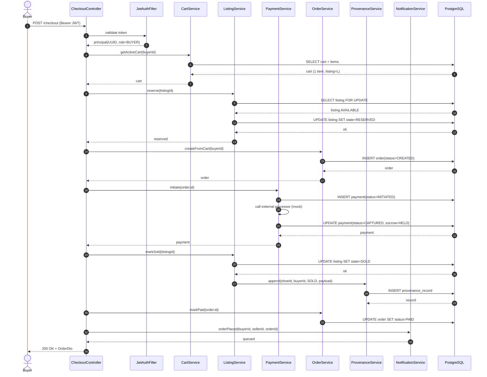
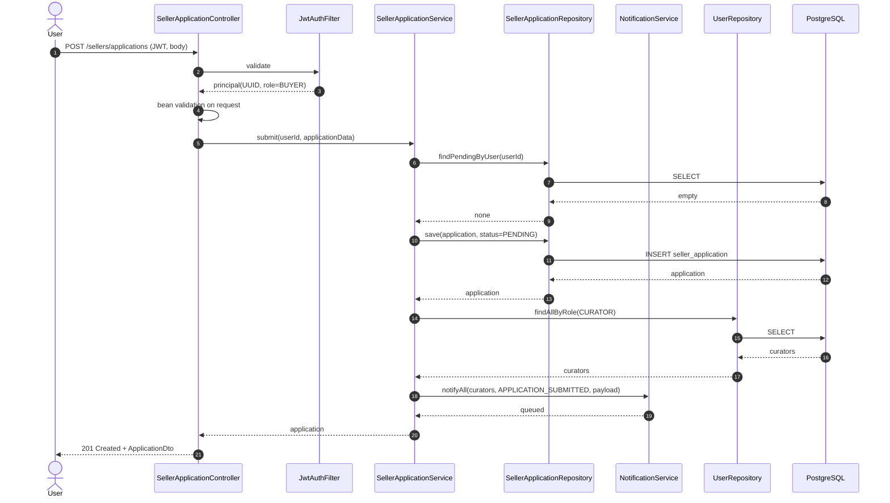
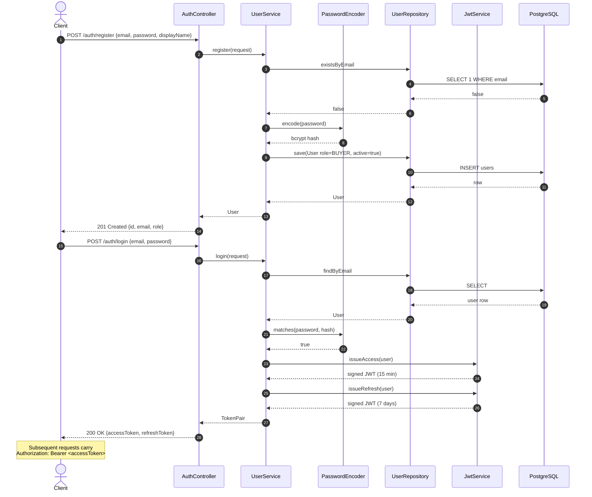
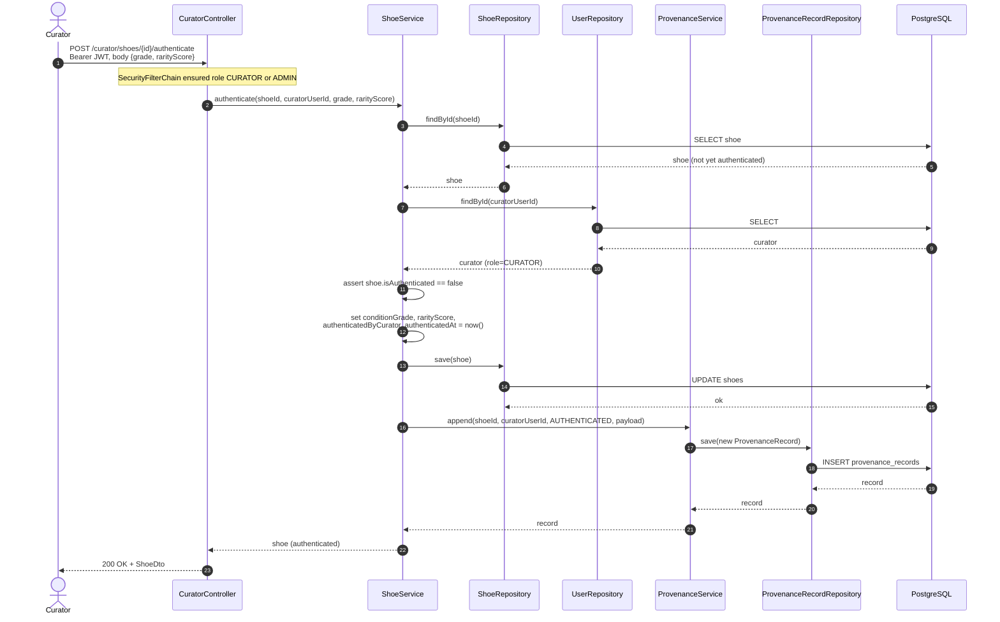
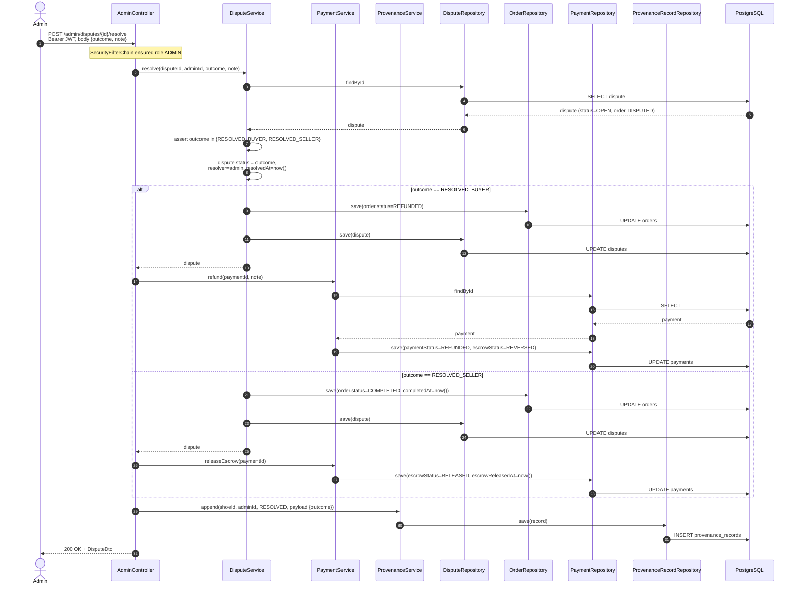
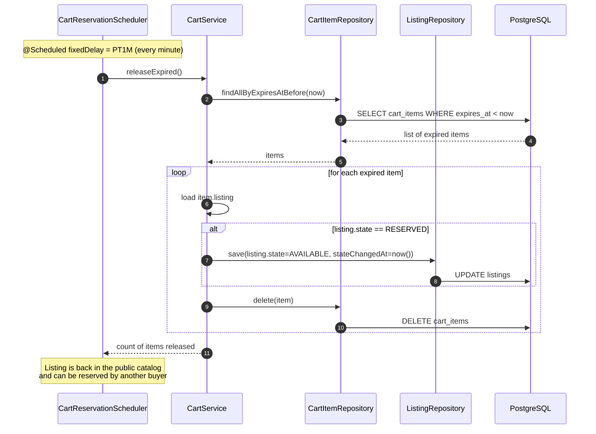

# 1.5 — Sequence Diagrams

## 5.1 — POST /listings (Seller creates a listing)



---

## 5.2 — POST /checkout (Buyer completes purchase)



---

## 5.3 — POST /sellers/applications



---

## 5.4 — GET /listings/{id} (Public)

```mermaid
sequenceDiagram
    autonumber
    actor Visitor
    participant LC as ListingController
    participant LS as ListingService
    participant PS as ProvenanceService
    participant LR as ListingRepository
    participant PR as ProvenanceRecordRepository
    participant DB as PostgreSQL

    Visitor->>LC: GET /listings/{id}
    note over LC: no auth required (SecurityConfig permitAll)
    LC->>LS: findById(id)
    LS->>LR: findById(id)
    LR->>DB: SELECT listing JOIN shoe
    DB-->>LR: listing + shoe
    LR-->>LS: listing
    LS-->>LC: listing
    LC->>PS: chainFor(listing.shoe.id)
    PS->>PR: findByShoeIdOrderByOccurredAtAsc
    PR->>DB: SELECT provenance_record ORDER BY occurred_at
    DB-->>PR: records
    PR-->>PS: records
    PS-->>LC: chain
    LC->>LC: assemble ListingDetailDto<br/>(ListingDto + List&lt;ProvenanceRecordDto&gt;)
    LC-->>Visitor: 200 OK + ListingDetailDto
```

> Seller identity is not dereferenced in this response — clients that want the
> seller's public profile call `GET /sellers/{id}` (see `SellerProfileController`).

---

## 5.5 — POST /auth/register + POST /auth/login (entry point)



---

## 5.6 — POST /curator/shoes/{id}/authenticate (curator authenticates a shoe)



---

## 5.7 — POST /admin/disputes/{id}/resolve (admin resolves a dispute)



---

## 5.8 — Cart reservation expiry sweeper (background)


