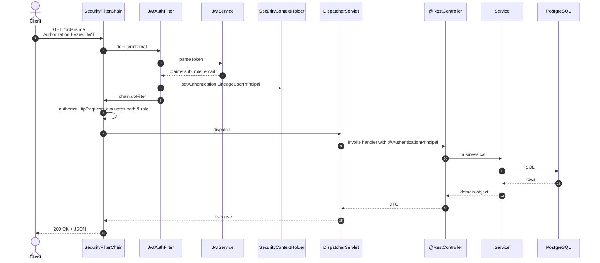

# 1.6 — Runtime Architecture

The single most useful onboarding diagram. Shows where everything lives and how a request travels through the stack.

## Layered architecture

```mermaid
flowchart TB
    Client[HTTP client<br/>browser, curl, mobile]
    subgraph Boot [Spring Boot application]
        direction TB
        subgraph Web [Web layer]
            FilterChain[SecurityFilterChain<br/>+ JwtAuthFilter]
            DispatcherServlet
            subgraph Controllers
                AuthC[AuthController]
                ListingC[ListingController]
                CartC[CartController]
                CheckoutC[CheckoutController]
                OrderC[OrderController]
                CommentC[CommentController]
                ReviewC[ReviewController]
                DisputeC[DisputeController]
                CuratorC[CuratorController]
                AdminC[AdminController]
                ShoeC[SellerShoeController]
                SellerAppC[SellerApplicationController]
            end
            Advice["@RestControllerAdvice<br/>GlobalExceptionHandler"]
            Mappers[ListingMapper / DomainMappers]
        end

        subgraph Services
            UserS[UserService]
            ListingS[ListingService]
            ShoeS[ShoeService]
            CartS[CartService]
            CheckoutS[CheckoutService]
            OrderS[OrderService]
            PaymentS[PaymentService]
            ProvenanceS[ProvenanceService]
            CommentS[CommentService]
            ReviewS[ReviewService]
            DisputeS[DisputeService]
            SellerAppS[SellerApplicationService]
            NotificationS[NotificationService]
        end

        subgraph Repos [Repositories - Spring Data JPA]
            UserRepo[UserRepository]
            ListingRepo[ListingRepository]
            ShoeRepo[ShoeRepository]
            CartRepo[CartRepository]
            OrderRepo[OrderRepository]
            PaymentRepo[PaymentRepository]
            ProvenanceRepo[ProvenanceRecordRepository]
            CommentRepo[CommentRepository]
            ReviewRepo[ReviewRepository]
            DisputeRepo[DisputeRepository]
            SellerAppRepo[SellerApplicationRepository]
            SellerProfileRepo[SellerProfileRepository]
            NotificationRepo[NotificationRepository]
        end

        Scheduler[CartReservationScheduler<br/>@Scheduled fixedDelay 1m]
        Seeder["DevDataSeeder<br/>@Profile(local) CommandLineRunner"]
    end

    DB[(PostgreSQL)]
    Docs[springdoc-openapi<br/>+ Scalar reference UI]

    Client -->|HTTP| FilterChain
    FilterChain --> DispatcherServlet
    DispatcherServlet --> Controllers
    Controllers -->|throws| Advice
    Controllers --> Mappers
    Controllers --> Services
    Services --> Repos
    Repos -->|JDBC| DB
    Scheduler --> CartS
    Seeder -->|CommandLineRunner| UserRepo
    Client -.->|GET /v3/api-docs<br/>GET /scalar| Docs
    Docs -.->|introspects| Controllers
```

## Authentication request flow



## Cart reservation lifecycle (background sweeper)

```mermaid
flowchart LR
    subgraph Foreground
        A[POST /cart/items<br/>BUYER]
        B[CartService.addItem]
        C[Listing AVAILABLE -> RESERVED?<br/>only via /checkout or reserveListing]
    end
    subgraph Background
        S[CartReservationScheduler<br/>@Scheduled fixedDelay PT1M]
        R[CartService.releaseExpired]
        F["For each CartItem where expires_at < now"]
        D["Delete CartItem"]
        L["If listing.state == RESERVED -> AVAILABLE"]
    end
    A --> B --> C
    S --> R --> F --> D --> L
```

## Why the layers are separate

| Layer | What's allowed | What's forbidden |
|---|---|---|
| Controller | DTO in, DTO out, calls services. Throws nothing — exceptions bubble to `GlobalExceptionHandler`. | No JPA. No business logic. No multi-step transactions. |
| Service | All business rules. State-machine transitions. `@Transactional`. | No HTTP types. No `@RestController` references. |
| Repository | Spring Data JPA queries. | No business logic. No service injection. |
| Domain | JPA entities and enums. | No service references. No DTO knowledge. Constructors via builders. |

The **`ProvenanceService`** is the only service whose interface has been deliberately constrained: no `update*`, no `delete*`, no `remove*`. This is enforced by a reflection-based unit test (`ProvenanceServiceTest.serviceInterface_hasNoUpdateOrDeleteMethods`) so the immutability invariant survives refactors.

## Where to add new functionality

| Adding... | Touches |
|---|---|
| A new entity | `domain/`, new `repository/`, new `service/`, new `controller/`, new DTOs in `dto/<area>/`, register in `DomainMappers` (or add a new mapper). |
| A new endpoint on existing entity | Controller method + `@Operation`/`@ApiResponse`, possibly a new DTO. |
| A new public route | Add to `SecurityConfig.filterChain` and to the README endpoint cheat sheet. |
| A new state-machine transition | Method on the relevant `*ServiceImpl` that asserts the prior state and throws `ConflictException` on invalid transitions. Add a unit test. |
| A new background job | Class under `config/` annotated `@Component` + `@Scheduled`. Application is `@EnableScheduling` already. |
